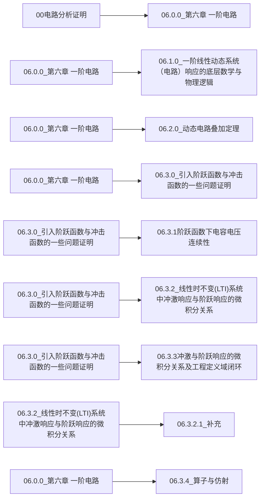

这是一个专注于从第一性原理出发，通过严谨的数学（如线性代数、麦克斯韦方程组）推导电路原理核心命题的开源笔记仓库。

📖 项目初衷
在电子信息专业的学习中，工程近似固然重要，但对于追求本质的开发者来说，只有严谨的推导才能带来安全感。本项目旨在打破“背公式”的传统模式，复现每一个定理的底层逻辑。

🛠️ 推荐阅读方式（重点）
为了获得最佳的阅读体验（包括查看数学公式渲染和 Obsidian Canvas 画布思维导图），强烈建议采用以下方案：

本地使用 Obsidian 查看：

克隆本仓库到本地。

在 Obsidian 中将其作为“库（Vault）”打开。

安装并配置 Obsidian Git 插件以同步更新。

为什么不建议直接在网页端查看？：

GitHub 网页端目前无法直接渲染 Obsidian 的 .canvas 画布文件，会导致思维导图显示为 JSON 代码。

部分复杂的 LaTeX 公式在浏览器自动翻译下可能会出现显示异常。

🧠 核心内容
一阶线性动态系统响应：电容电压连续性的广义函数证明（冲激配平法），持续更新当中。

电路分析基本定理：KCL、KVL 与替代定理的严格证明。

🤝 贡献与交流
如果你也对严谨电路理论感兴趣，欢迎提交 Pull Request 或 Issue 进行探讨。
这也是我第一次用github上传知识，还有许多地方没有优化好，后续也会不断又换并且更新

作者：王久一
<!-- START_CANVAS -->

<!-- END_CANVAS -->
